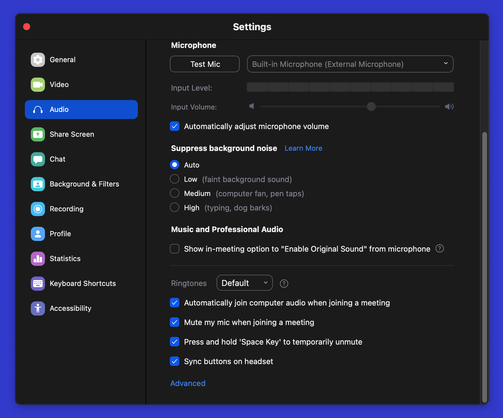
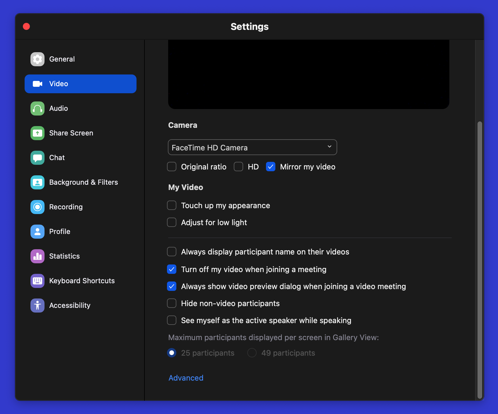

# Zoom_Automation-MacOs
A python script which logs into **Zoom** classes automatically.

[![Project Maintenance][maintenance-shield]](https://github.com/Crispy-Justice)

### Features
* Automagically opens **Zoom** and enters the meeting id and meeting password for you.
* Keeps track of the meetings joined in _log.txt_ with time and date.
* Stores you **timetable**.

## Requirements 
- [x] Installed python version above 3.5
- [x] Installed pyautogui package
- [x] Installed pyttsx3 package
- [x] Installed tabulate package
- [x] Updated Zoom Software (Signed in)

#### To install the above packages :
+ To [Download Python](https://www.python.org/downloads/)
+ `pip install pyautogui`
+ `pip install pyttsx3`
+ `pip install tabulate`
+ To [Download Zoom Software](https://zoom.us/download#client_4meeting)

## Setting up configurations :

#### Make sure the Zoom settings are as follows
##### Set the Audio Settings as follows :

##### Set the Video Settings as follows :

# How to run the program :
##### Clone this repository and unzip it
* cd into the directory
* update info.py with your meeting ids and passwords of the respective subjects.
* update info.py the timetable
* run `python main.py`

#### If you get this error `'NoneType' object has no attribute 'x'`
* capture a screenshot of the Zoom home page.
* crop the image to only show the 'join' button.
* paste it into the directory.
* rename it to `join_button.png`

## For any bugs/fixes:
##### Please create an issue in this repo and I'll try to fix it as soon possible.

## Any Contributions or Additions:
##### Please create a pull request and try to make this code better

## Upcoming:
- [ ] New GUI Interface for the inputs instead of CLI.
- [ ] Better code with fewer dependencies.
- [ ] Voice commands.

_*Drop a ⭐ if you liked it.*_
